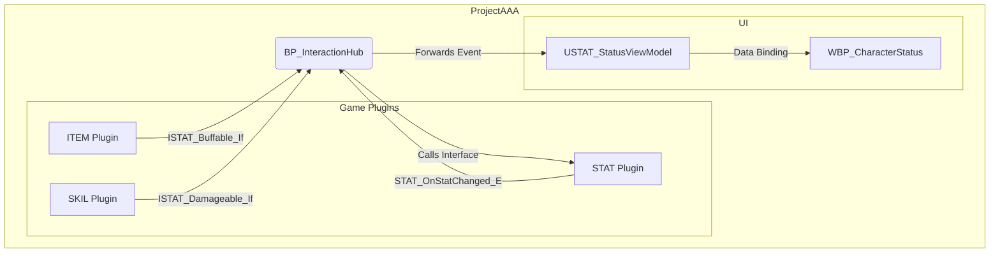
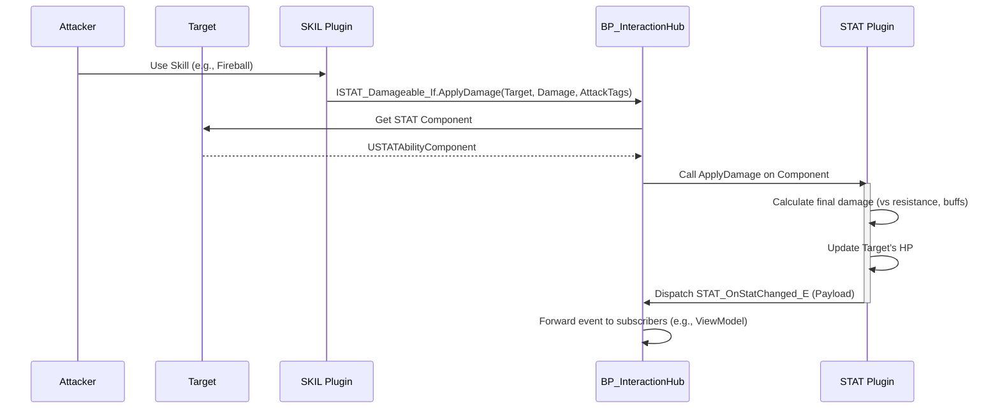

### **D. 시각적 명세 및 흐름도: 캐릭터 상태(STAT) 시스템**

#### **1. 다이어그램의 종류 및 목적 (Types of Diagrams & Their Purpose)**
*   **L0: 시스템 컨텍스트 및 아키텍처**: 시스템의 최상위 구조, 주요 모듈, 외부 시스템과의 경계를 시각화합니다. (관련 문서: `A.STAT_Contract.md`)
*   **L1: 개발 프로세스 및 파이프라인**: `B.STAT_Schema.md`의 변경이 어떻게 AI의 코드 생성으로 이어지는지 개발 워크플로를 시각화합니다. (관련 문서: `C.STAT_Process_and_Gates.md`, `F.STAT_JobOrders.md`)
*   **L2: 핵심 런타임 로직**: `ApplyDamage`와 같은 핵심 기능의 런타임 상호작용 순서를 시각화합니다. (관련 문서: `A.STAT_Contract.md`)

#### **2. 다이어그램 작성 정책 (Diagram Authoring Policy)**
*   **용어 동기화**: 다이어그램 내 노드(Node)의 이름은 반드시 `A`, `B`, `C` 문서에서 사용된 핵심 용어 및 클래스/함수명과 **문자열 수준에서 동일**해야 합니다.
*   **상호 참조**: 모든 다이어그램은 어떤 문서를 시각화한 것인지 명확히 표기해야 합니다. (예: `(Source: A.STAT_Contract.md)`)

---
#### **L0: 시스템 컨텍스트 및 아키텍처**


#### **L1: 개발 프로세스 및 파이프라인**```mermaid
flowchart LR
    A[Human: `B.STAT_Schema.md` 수정] --> B{CI/CD Pipeline Trigger}
    B --> C[AI: `F.STAT_JobOrders.md` 실행]
    C --> D{`applied_principles` 준수 검증}
    D -- A0, A1, Z1 등 --> E[AI: 코드/테스트 생성]
    E --> F{`C.STAT_Process_and_Gates.md` 품질 게이트}
    F -- 자동화 테스트 통과 --> G[Pull Request 생성]
    G --> H[Human: 최종 검증 및 병합]
```

#### **L2: 핵심 런타임 로직 - ApplyDamage**
